# Software Studio 2025 Spring
## Assignment 01 Web Canvas

### Scoring

| **Basic components** | **Score** | **Check** |
| :------------------- | :-------: | :-------: |
| Basic control tools  |    30%    |     Y     |
| Text input           |    10%    |     Y     |
| Cursor icon          |    10%    |     Y     |
| Refresh button       |    5%     |     Y     |

| **Advanced tools**     | **Score** | **Check** |
| :--------------------- | :-------: | :-------: |
| Different brush shapes |    15%    |     Y     |
| Un/Re-do button        |    10%    |     Y     |
| Image tool             |    5%     |     Y     |
| Download               |    5%     |     Y     |

| **Other useful widgets** | **Score** | **Check** |
| :----------------------- | :-------: | :-------: |
| Shape filled checkbox    |   1~5%    |     Y     |

---

### How to use 

This is a web canva with some painting tools **(pen, eraser, text, circle, rectangle, triangle)** and style setting functions. The below is the introduction of how to use these functions.

#### Painting tools
When a painting tool is selected, the mouse cursor changes to a corresponding icon, making it easier for users to identify the current tool.

* **Pen** :  
This is the basic drawing function on the canvas. After clicking the pen icon, the cursor changes to a pen shape in the canva range. By clicking and dragging the mouse, your movement will be visualized on the canvas using the selected brush size and color.
  * The pen icon in the paint-tool section
    

    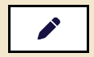
    

  * The pen effect on canvas
    

    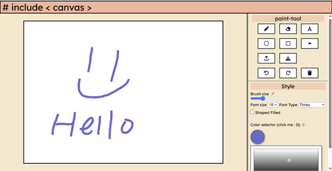
    

* **Eraser** :  
This enables users to erase previously drawn elements on the canvas, including pen strokes, text, circles, rectangles, and triangles or even the uploaded images. The eraser size is also affected by the brush size slider.
  * The eraser icon in the paint-tool section
    

    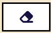
    

  * The eraser effect on canvas (the uncontinuous part is caused by the eraser)
    

    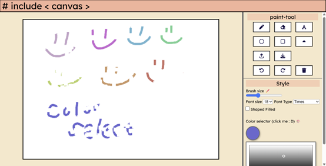
    

* **Text** :  
This tool allows users to embed text onto the canvas using the keyboard. After clicking the text icon, an input box will appear. Users can type their text using the keyboard and **press "Enter" to confirm and embed the text onto the canvas.**
  * The text icon in the paint-tool section
    

    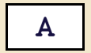
    

  * The input box for users to type in
    

    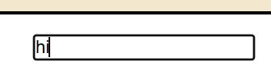
    

  * Final Embedded Effect on the Canvas (the "Hi")
    

    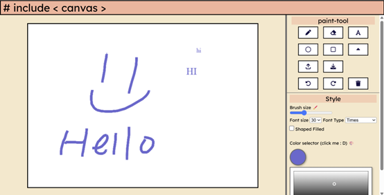
    

* **Circle** :  
This tool allows users to draw circles on the canvas. The initial mouse position serves as the center of the circle, and dragging the mouse adjusts the radius. When the mouse button is released, the circle is rendered on the canvas.
  * The circle icon in the paint-tool section
    

    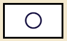
    

* **Rectangle** :  
This tool allows users to draw rectangles on the canvas. The initial mouse position serves as the top-right corner, and dragging the mouse adjusts the rectangle's size. When the mouse button is released, the rectangle is rendered on the canvas.
  * The rectangle icon in the paint-tool section
    

    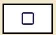
    

* **Triangle** :  
This tool allows users to draw triangles on the canvas. The initial mouse position serves as one point of the triangle, and dragging the mouse adjusts the triangle's size. When the mouse button is released, the triangle is rendered on the canvas.
  * The triangle icon in the paint-tool section
    

    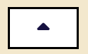
    

And this is the integrated test of all the painting functions.

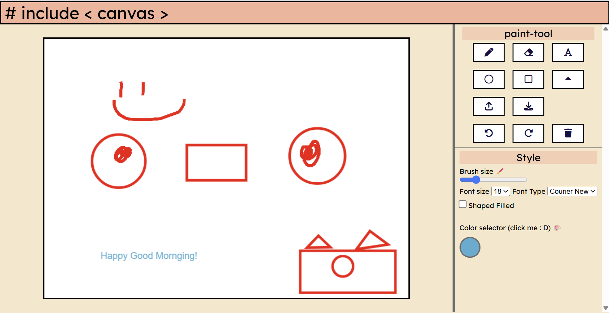

#### Other function buttons
* **Undo** :  
This tool would undo the present instruction on canvas if it is NOT the first instruction.
  * The undo icon in the paint-tool section
    

    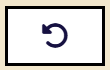
    

* **Redo** :  
This tool would redo the before instruction on canvas if it is NOT the latest instruction.
  * The redo icon in the paint-tool section
    

    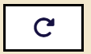
    

* **Reset (Trash)** :  
Reset function enables the user to clean all the elements on the canva.
  * The reset icon in the paint-tool section
    

    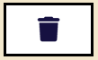
    

* **Upload** :  
This function allows the user to upload a random img file from computer, it would resize to fit the canva weight and height.
  * The upload icon in the paint-tool section
    

    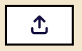
    

  * The upload effect on the canvas (done by uploading the screenshot)
    

    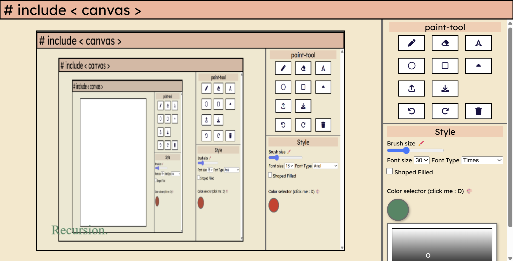
    

* **Download** :  
After pressing this button, users could download the current canva as **"masterpiece.png"** to the download folder in local.
  * The download icon in the paint-tool section
    

    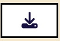
    

#### Style setting section
* **Brush size** :  
This slider range from 1 to 20, representing the size of painting tools.
  * The brush size slider in the Style setting section
    

    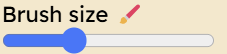
    

  * The effect of different brush size 
    

    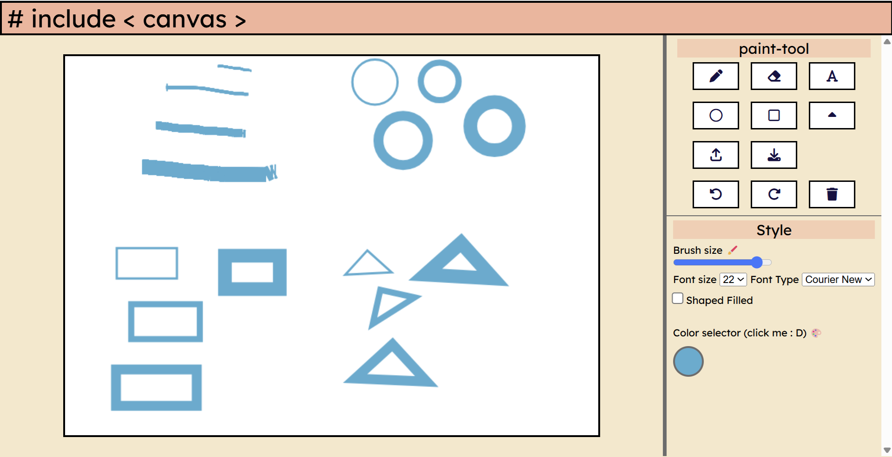
    

* **Font size && Font type** :  
These two dropdown menus have options of font size and font type of the text embed on the canvas.
  * The font size and type in the Style setting section
    

    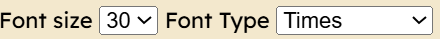
    

    

    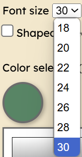
    

    

    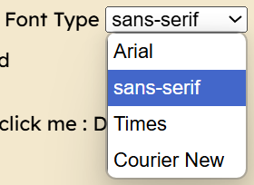
    

  * The effect of different font size and font type 
    

    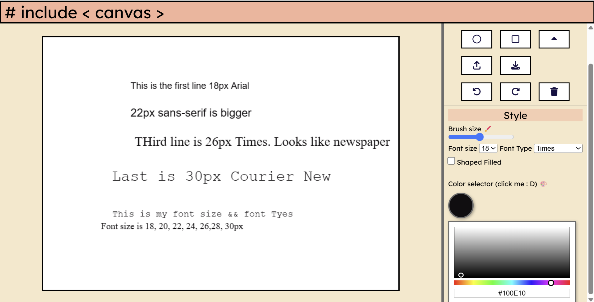
    

* **Color Selector** :  
User could click the color preview of present brush color for the pop-up color panel.
 
After opening the panel, users can adjust the color by selecting it from the panel or using the slider. Additionally, users can input the desired hex code in the hex input field below (note: the system will detect invalid hex codes).
 
The panel could be opened or closed by **clicking on the color preview**.
  * The color preview in the Style setting section
    

    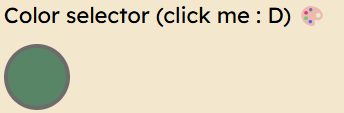
    

  * The color panel 
    

    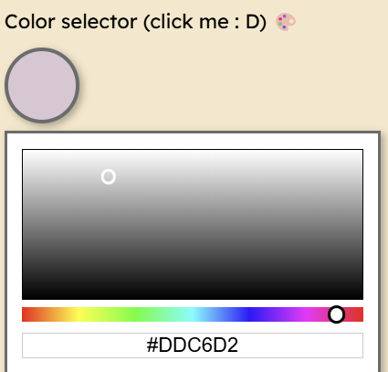
    

  * The effect of different chosen color 
    

    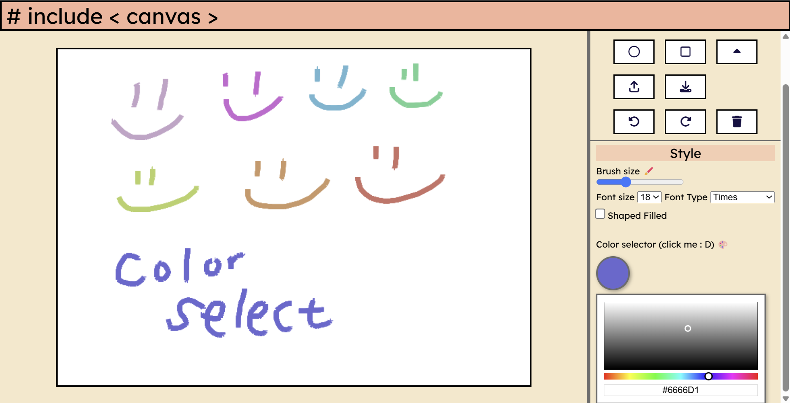
    

### Bonus Function description

* **Shape filled selector** :  
There is a filled checkbox that enable the user to draw shapes (circle, rectangle, triangle) that filled with the chosen color.
  * The checkbox in the Style setting section
    

    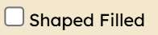
    

  * The Shape filled effect (The left shape is drawn with the normal tool, while the right one is drawn with the "Fill Shape" option enabled.)
    

    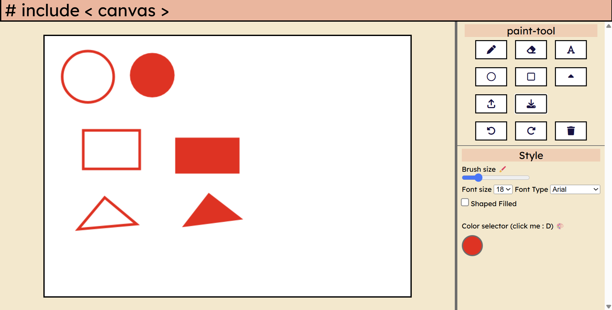
    

### Web page link

    https://myawesomecanvas-61f19.web.app

### Others (Optional)

    非...非常好小畫家 : D

